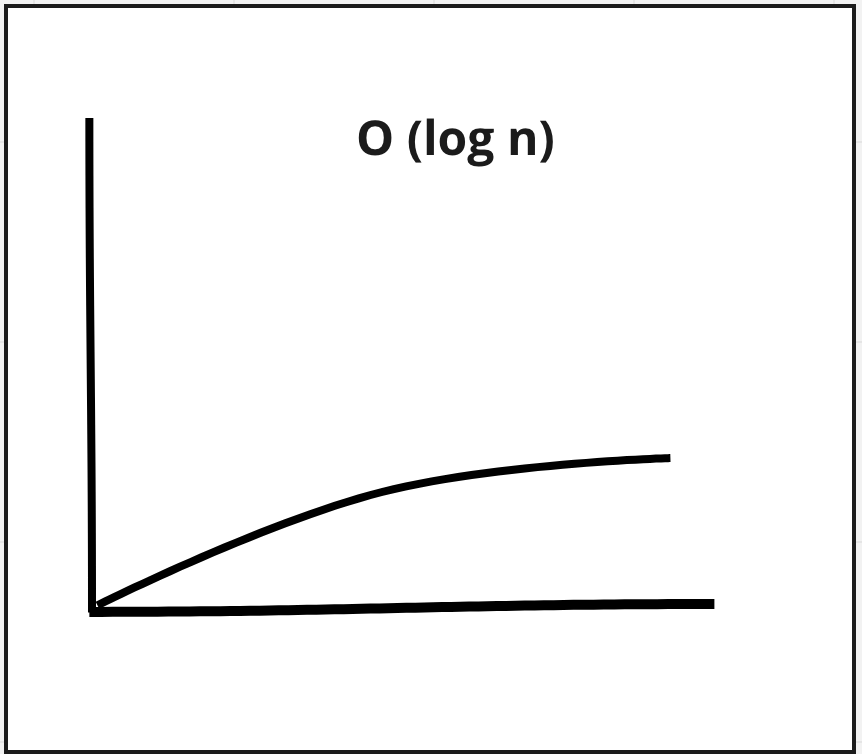

# Binary Search

**Binary search takes a sorted array and returns the position of given item.** 

To understand binary search it helps to think about a simple search method.

For example, let's play a game: pick a number between 1 and 100.

A simple search would start 1 and check every number until  the chosen number is reached. The worse case being that the chosen number is 100 and to find it you would need to make a 100 guesses.

In contrast, binary search would start at the mid point, i.e 50 and asks if the number is lower or high, then it would take the upper or lower half, repeat the process, find the mid point and check again until the chosen number is found.   

#### Steps
1. find the mid point 
2. if the number is higher take the higher half, if the number is lower take the lower half.
3. repeat steps 1 & 2 until the number is found.

simple search - (100 items, 100 guesses) Linear Time: O(n)

binary search -  (100 items, 7 guesses) Log time O(log n)

