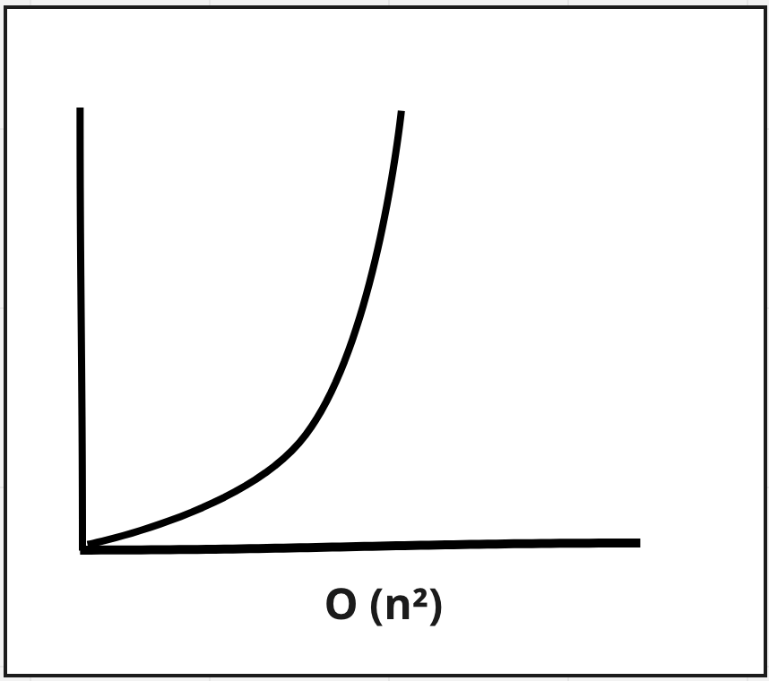

# Selection Sort

O(n²)

**Selection sort takes a list and returns a sorted list**

Iterates through a list selecting the smallest item and moves it to the position of the current number that we are comparing it with.

## Steps
1. loop through the list of numbers, save current index as the "lowest" variable 
2. iterate through the remainder of the list and comparing each item to the current "lowest" 
3. if the item is lower then save it  as the "lowest"
4. once the end of the list is reached, swap the current item with "lowest"
5. repeat for each item in the array. 

